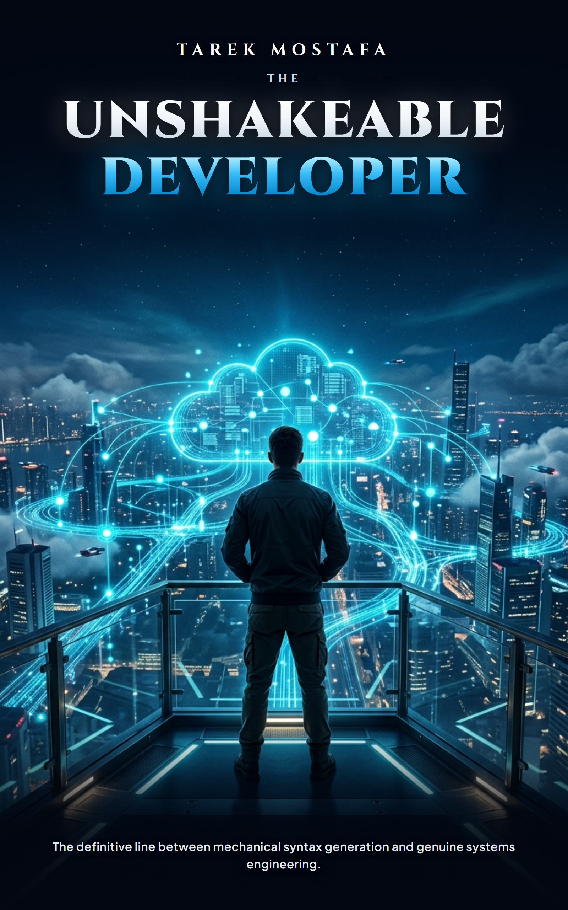
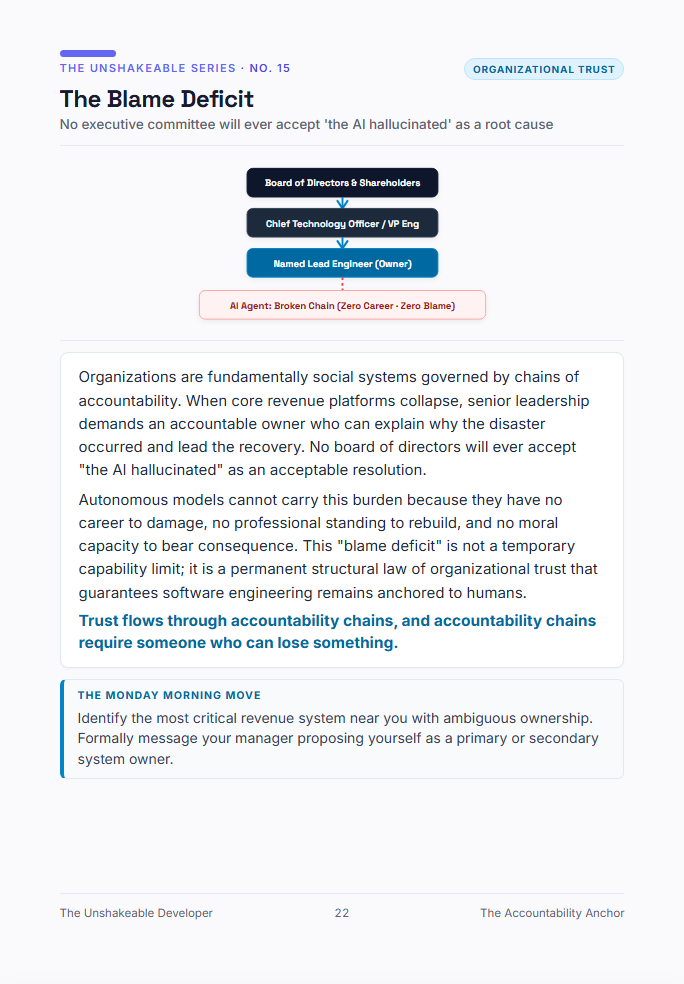

# The Unshakeable Developer 🛡️
### *Why AI Won't Replace True Software Engineers — Battle-Tested Blueprints for Architectural Survival*

[](https://www.amazon.com/dp/B0HK2PCRJK)
[](https://www.amazon.com/dp/B0HK2PCRJK)
[](https://hashnode.com)
[](https://dev.to)
[](LICENSE)

<p align="center">
  <a href="https://www.amazon.com/dp/B0HK2PCRJK">
    
  </a>
</p>

---

## 🧭 The Core Thesis

> **"Syntax is the output of software engineering, not the substance of it. When output becomes free, substance becomes everything."**

For twenty years, developers anchored their identity to syntactic fluency: memorizing framework quirks, API signatures, and language idioms. Today, models trained on billions of lines generate clean code in seconds for pennies. 

The industry anxiety is not that software engineering is dead; it is that the narrow, mechanical act of **converting specs to syntax has met its natural market price: zero.**

True software engineering was never about typing syntax into an IDE. It is about:
1. **Discovering unstated, conflicting requirements** beneath ambiguous user tickets.
2. **Isolating blast radius** so partial outages don't cascade into enterprise bankruptcy.
3. **Underwriting tail risk** — bearing operational accountability when production crashes at 3:00 AM.
4. **Governing distributed boundaries** where autonomous models hallucinate across invisible seams.

This repository contains selected visual blueprints, field audit worksheets, and architectural laws from the book **[The Unshakeable Developer: Why AI Won't Replace True Software Engineers](https://www.amazon.com/dp/B0HK2PCRJK)** by **Tarek Mostafa**.

---

## 📜 The Sovereign Developer Manifesto

*Eight non-negotiable architectural laws for the load-bearing engineer:*

```text
1. I do not compete with machines on keystroke velocity.
2. I own the ambiguity models cannot parse and consequences they cannot bear.
3. I can be paged, I can be trusted, and I claim operational accountability.
4. I verify before I ship, and cosign only what I will defend at 3:00 AM.
5. I bridge the gulf between what was asked and what was truly needed.
6. I direct AI as infinite leverage — I never surrender judgment to it.
7. My value was never the code; it was the decisions the code made real.
8. I am not a human transpiler. I am an unshakeable systems architect.
```

---

## 📐 Featured Architectural Blueprints

Each concept in the book is engineered as a self-contained, 1-page visual blueprint:

| # | Blueprint Title | Focus Area | Core Takeaway |
|---|---|---|---|
| **01** | [The Death of the Human Transpiler](blueprints/01-the-death-of-the-human-transpiler.md) | `Diagnostic` | Converting Jira tickets to syntax is a compiler pass, not a career. |
| **06** | [The Context Ceiling](blueprints/06-the-context-ceiling.md) | `System Limits` | Why distributed systems fail at invisible seams models cannot see. |
| **08** | [The Blast Radius Doctrine](blueprints/08-the-blast-radius-doctrine.md) | `Resilience Law` | Senior engineering is not making code work; it's deciding how it fails. |
| **14** | [Pull Request as a Contract](blueprints/14-pull-request-as-a-contract.md) | `Review Rigor` | 'LGTM' is not an approval — it is a sworn claim of shared operational liability. |
| **15** | [The Blame Deficit](blueprints/15-the-blame-deficit.md) | `Organizational Trust` | No executive committee will ever accept 'the AI hallucinated' as a root cause. |
| **26** | [The AI-Resilient Tech Stack](blueprints/26-the-ai-resilient-tech-stack.md) | `Skill Valuation` | Distinguishing rapidly depreciating syntax from compounding systems disciplines. |
| **27** | [The Developer Manifesto](blueprints/27-the-developer-manifesto.md) | `Core Creed` | Eight foundational principles to anchor your engineering identity. |

---

### Blueprint Spotlight: The Blame Deficit

<p align="center">
  
</p>

> *"Trust flows through accountability chains, and accountability chains require someone who has skin in the game — someone who can actually lose something. An algorithm has no equity, no career, and no balance sheet to pledge."*

---

### Blueprint Spotlight: The Blast Radius Doctrine

<p align="center">
  
</p>

> *"Any Junior engineer can make code work on the happy path. Senior engineering begins when you assume the network is hostile, the database is saturated, and external APIs will fail simultaneously."*

---

## 🛠️ Field Worksheets & Templates for Engineering Teams

Free drop-in operational tools for engineering managers and tech leads:

1. **[Production Blast Radius Scorecard](worksheets/production-blast-radius-scorecard.md)** — A 6-dimension rubric to evaluate system survivability under catastrophic downstream failure before shipping.
2. **[Pull Request Review Covenant](worksheets/pull-request-review-covenant.md)** — A drop-in GitHub PR review template that stops rubber-stamp `LGTM` fatigue and enforces architectural sign-offs.

---

## 📖 Get the Complete Book

The complete volume features **30+ full-page architectural blueprints**, 6 interactive sprint audit worksheets, and a comprehensive 4-week transformation playbook:

- **Part 01: The Syntax Collapse** — The economic and psychological shift reshaping software.
- **Part 02: The Architectural Moat** — Blast radius, context ceilings, CAP theorem, and distributed resilience.
- **Part 03: Skin in the Code** — The Blame Deficit, PR contracts, and operational ownership.
- **Part 04: The Socio-Technical Moat** — System diplomacy, spec gaps, and executive trust.
- **Part 05: The Sovereign Architect** — Agentic leverage, resume transformation, and AI-resilient tech stacks.
- **Part 06: Field Audits & Worksheets** — 6 actionable workbooks to deploy with your team.

👉 **[Order on Amazon (Kindle & 7x10 Premium Color Paperback)](https://www.amazon.com/dp/B0HK2PCRJK)**

---

## ✍️ Author & Community

**Tarek Mostafa**  
*Lead Software Engineer & Systems Architect*  
- Author of *The Unshakeable Developer: Why AI Won't Replace True Software Engineers*
- Read the live article discussions on [DEV.to](https://dev.to) and [Hashnode](https://hashnode.com)
- Connect for architectural reviews, engineering advisory, and speaking engagements.

Read the complete career strategy: 
How to AI-Proof Your Career on Medium: https://medium.com/@tarikmostafaabohagar/i-thought-ai-had-ended-my-career-then-i-stopped-competing-with-the-machine-e87649d116e1

---

## ⚖️ License

The sample blueprints and worksheets in this repository are licensed under [Creative Commons Attribution-NonCommercial 4.0 International (CC BY-NC 4.0)](LICENSE).  
The full text, visual diagrams, and layouts of *The Unshakeable Developer* book are Copyright © 2026 Tarek Mostafa. All rights reserved.
