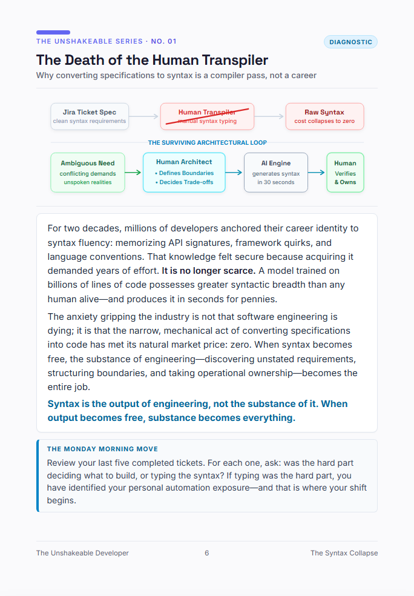

# Blueprint #01: The Death of the Human Transpiler
> **Why converting specifications to syntax is a compiler pass, not a career**  
> *Category: `Diagnostic` · Excerpt from [The Unshakeable Developer](https://www.amazon.com/dp/B0HK2PCRJK)*

  

---

### 📐 The Architectural Reality

For two decades, millions of developers anchored their career identity to syntax fluency: memorizing API signatures, framework quirks, and language conventions. That knowledge felt secure because acquiring it demanded years of effort. **It is no longer scarce.** A model trained on billions of lines of code possesses greater syntactic breadth than any human alive—and produces it in seconds for pennies.

The anxiety gripping the industry is not that software engineering is dying; it is that the narrow, mechanical act of converting specifications into code has met its natural market price: zero. When syntax becomes free, the substance of engineering—discovering unstated requirements, structuring boundaries, and taking operational ownership—becomes the entire job.

> 💡 **Core Law:**  
> *"Syntax is the output of engineering, not the substance of it. When output becomes free, substance becomes everything."*

---

### 🏃 The Monday Morning Move
Review your last five completed tickets. For each one, ask: was the hard part deciding what to build, or typing the syntax? If typing was the hard part, you have identified your personal automation exposure—and that is where your shift begins.

---

[← Back to Blueprints Overview](../README.md#featured-architectural-blueprints) | [Order Complete Book on Amazon](https://www.amazon.com/dp/B0HK2PCRJK)
