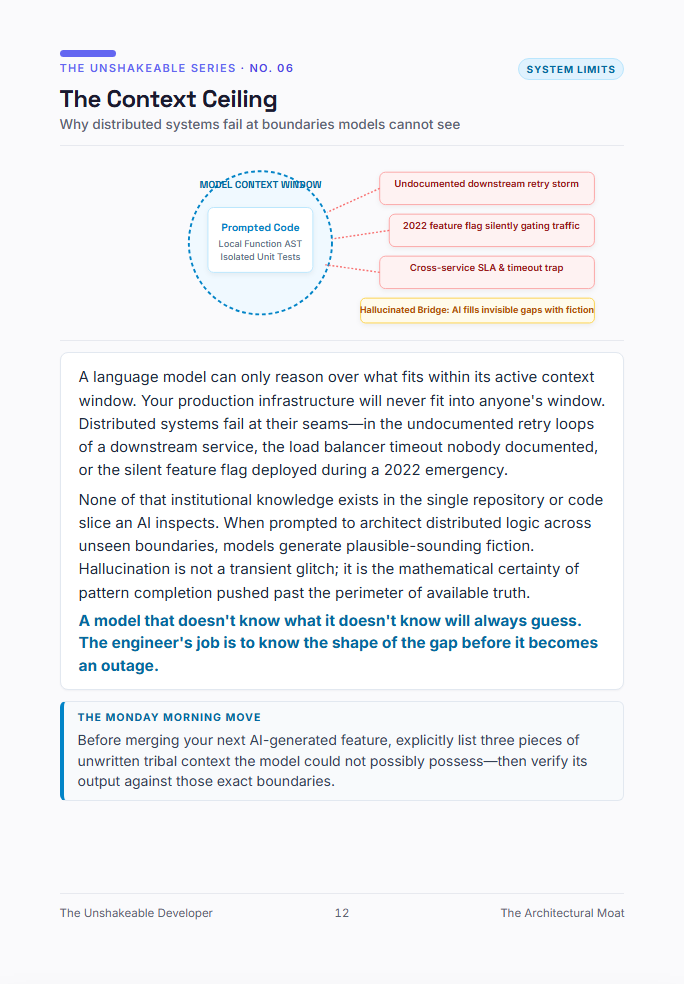

# Blueprint #06: The Context Ceiling
> **Why distributed systems fail at boundaries models cannot see**  
> *Category: `System Limits` · Excerpt from [The Unshakeable Developer](https://www.amazon.com/dp/B0HK2PCRJK)*

  

---

### 📐 The Architectural Reality

A language model can only reason over what fits within its active context window. Your production infrastructure will never fit into anyone's window. Distributed systems fail at their seams—in the undocumented retry loops of a downstream service, the load balancer timeout nobody documented, or the silent feature flag deployed during a 2022 emergency.

None of that institutional knowledge exists in the single repository or code slice an AI inspects. When prompted to architect distributed logic across unseen boundaries, models generate plausible-sounding fiction. Hallucination is not a transient glitch; it is the mathematical certainty of pattern completion pushed past the perimeter of available truth.

> 💡 **Core Law:**  
> *"A model that doesn't know what it doesn't know will always guess. The engineer's job is to know the shape of the gap before it becomes an outage."*

---

### 🏃 The Monday Morning Move
Before merging your next AI-generated feature, explicitly list three pieces of unwritten tribal context the model could not possibly possess—then verify its output against those exact boundaries.

---

[← Back to Blueprints Overview](../README.md#featured-architectural-blueprints) | [Order Complete Book on Amazon](https://www.amazon.com/dp/B0HK2PCRJK)
