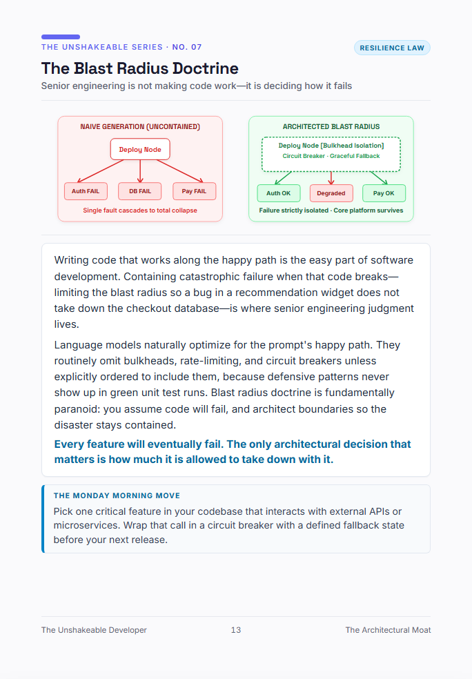

# Blueprint #08: The Blast Radius Doctrine
> **Senior engineering is not making code work—it is deciding how it fails**  
> *Category: `Resilience Law` · Excerpt from [The Unshakeable Developer](https://www.amazon.com/dp/B0HK2PCRJK)*

  

---

### 📐 The Architectural Reality

Junior engineers write code assuming dependencies respond, networks endure, and inputs conform. Senior engineers write systems assuming everything external is actively hostile or already collapsing. When AI accelerates code production by 10x, it also accelerates the propagation of systemic fragility.

Architectural maturity is measured by blast radius containment: decoupling critical transaction paths from non-essential analytics, configuring bulkhead isolation, and designing graceful degradation fallbacks. If a third-party webhook failure can halt your primary revenue stream, you have not engineered a system—you have assembled a chain of dominoes.

> 💡 **Core Law:**  
> *"Any system can look elegant under zero load. Architectural maturity is proven only under catastrophic failure."*

---

### 🏃 The Monday Morning Move
Audit your core production service against the 6-dimension Blast Radius Scorecard. Identify the single lowest score and schedule its remediation in your upcoming sprint backlog.

---

[← Back to Blueprints Overview](../README.md#featured-architectural-blueprints) | [Order Complete Book on Amazon](https://www.amazon.com/dp/B0HK2PCRJK)
