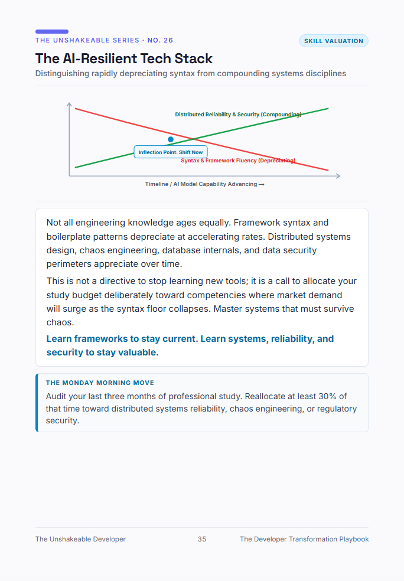

# Blueprint #26: The AI-Resilient Tech Stack
> **Distinguishing rapidly depreciating syntax from compounding systems disciplines**  
> *Category: `Skill Valuation` · Excerpt from [The Unshakeable Developer](https://www.amazon.com/dp/B0HK2PCRJK)*

  

---

### 📐 The Architectural Reality

Not all engineering knowledge ages equally. Framework syntax and boilerplate patterns depreciate at accelerating rates. Distributed systems design, chaos engineering, database internals, and data security perimeters appreciate over time.

This is not a directive to stop learning new tools; it is a call to allocate your study budget deliberately toward competencies where market demand will surge as the syntax floor collapses. Master systems that must survive chaos.

> 💡 **Core Law:**  
> *"Learn frameworks to stay current. Learn systems, reliability, and security to stay valuable."*

---

### 🏃 The Monday Morning Move
Audit your last three months of professional study. Reallocate at least 30% of that time toward distributed systems reliability, chaos engineering, or regulatory security.

---

[← Back to Blueprints Overview](../README.md#featured-architectural-blueprints) | [Order Complete Book on Amazon](https://www.amazon.com/dp/B0HK2PCRJK)
