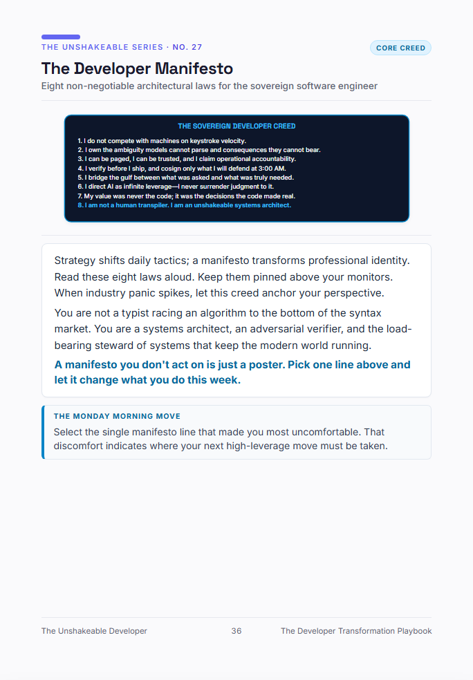

# Blueprint #27: The Developer Manifesto
> **Eight non-negotiable architectural laws for the sovereign software engineer**  
> *Category: `Core Creed` · Excerpt from [The Unshakeable Developer](https://www.amazon.com/dp/B0HK2PCRJK)*

  

---

### 📐 The Architectural Reality

Strategy shifts daily tactics; a manifesto transforms professional identity. Read these eight laws aloud. Keep them pinned above your monitors. When industry panic spikes, let this creed anchor your perspective.

You are not a typist racing an algorithm to the bottom of the syntax market. You are a systems architect, an adversarial verifier, and the load-bearing steward of systems that keep the modern world running.

> 💡 **Core Law:**  
> *"A manifesto you don't act on is just a poster. Pick one line above and let it change what you do this week."*

---

### 🏃 The Monday Morning Move
Select the single manifesto line that made you most uncomfortable. That discomfort indicates where your next high-leverage move must be taken.

---

[← Back to Blueprints Overview](../README.md#featured-architectural-blueprints) | [Order Complete Book on Amazon](https://www.amazon.com/dp/B0HK2PCRJK)
