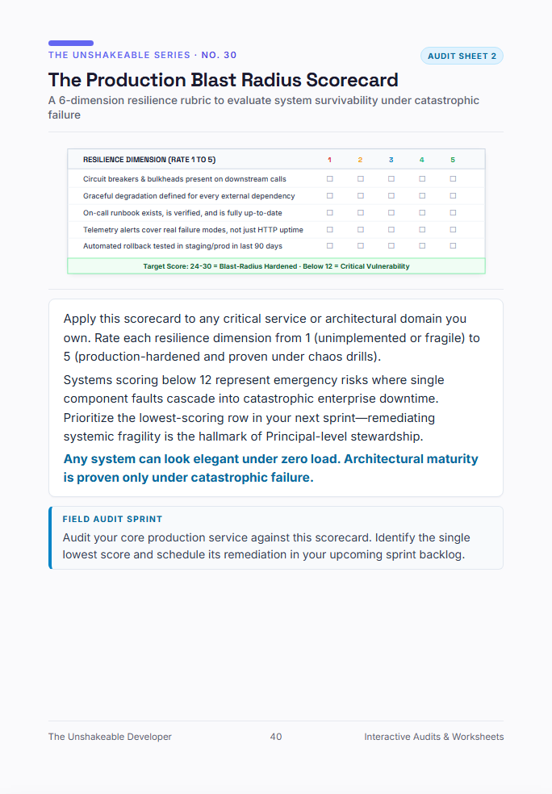

# The Production Blast Radius Scorecard
### *A 6-Dimension Resilience Rubric to Evaluate System Survivability Under Catastrophic Failure*

> *"Any system can look elegant under zero load. Architectural maturity is proven only under catastrophic failure."*  
> — From **[The Unshakeable Developer](https://www.amazon.com/dp/B0HK2PCRJK)** by Tarek Mostafa

  

---

## 🎯 How to Use This Scorecard

Apply this scorecard to any critical service or architectural domain you own. Rate each resilience dimension from **1** (unimplemented or fragile) to **5** (production-hardened and proven under chaos drills).

| Resilience Dimension | Score (1-5) | Evidence / Runbook Link |
|---|:---:|---|
| **1. Circuit Breakers & Bulkheads** Present and configured on every downstream external/internal call? | `[ ]` | |
| **2. Graceful Degradation** Explicit fallback UI/response defined when dependencies fail? | `[ ]` | |
| **3. Verified On-Call Runbook** Clear, step-by-step incident runbook tested within the last 90 days? | `[ ]` | |
| **4. Deep Telemetry Alerts** Alerts cover semantic failure modes and business metrics, not just HTTP ping? | `[ ]` | |
| **5. Automated Rollback Protocol** Tested automated rollback in staging/production in the last 90 days? | `[ ]` | |
| **6. Failure Domain Isolation** Blast radius of this component cannot take down the core billing/auth path? | `[ ]` | |

### 📊 Score Evaluation:
- **24 – 30 points:** **Blast-Radius Hardened** — Production-ready, resilient under chaos.
- **18 – 23 points:** **Operational Risk** — Vulnerable to cascading failure under high concurrency.
- **Below 18 points:** **Critical Vulnerability** — Single-point failure risk. Immediate sprint remediation required.

---

### 🏃 Field Audit Sprint (Monday Morning Move)
1. Pick the single lowest-scoring row in your current service.
2. Create a dedicated tech-debt ticket to bring that dimension to a rating of **4** or **5**.
3. Present the remediated score during your team's next sprint planning.

---
*For the complete workbook and 30+ architectural blueprints, check out **[The Unshakeable Developer on Amazon](https://www.amazon.com/dp/B0HK2PCRJK)**.*
