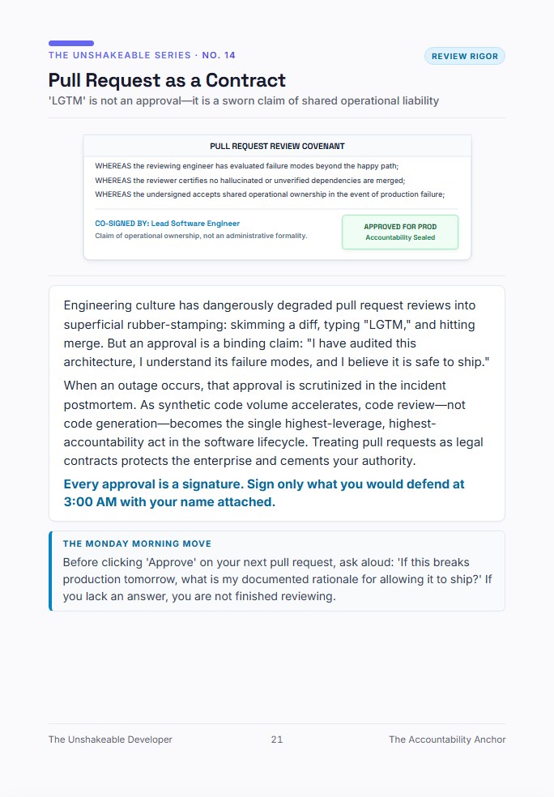

# Pull Request Review Covenant
### *Turning Code Review from Rubber-Stamp 'LGTM' into an Operational Contract*

> *"LGTM is not an approval — it is a sworn claim of shared operational liability. Sign only what you would defend at 3:00 AM with your name attached."*  
> — From **[The Unshakeable Developer](https://www.amazon.com/dp/B0HK2PCRJK)** by Tarek Mostafa

<p align="center">
  
</p>

---

## 📋 Drop-In Pull Request Template

Copy this template directly into your repository at `.github/PULL_REQUEST_TEMPLATE.md`:

```markdown
## 🔍 Architectural Context
- **Business Goal:** What user/system problem does this change solve?
- **Blast Radius Analysis:** What is the worst-case blast radius if this diff fails in production?
- **AI-Assisted Lines:** Were any portions of this code generated via LLM? If yes, specify boundaries checked:

---

## 🛡️ The Reviewer Covenant
*The undersigned approving engineer(s) attest to the following before clicking Approve:*

- [ ] **Beyond Happy Path:** I have audited failure modes, timeouts, and edge cases beyond the happy path.
- [ ] **No Hallucinated Boundaries:** I have verified all external API signatures, dependencies, and schema migrations against real infrastructure.
- [ ] **Operational Accountability:** If this diff triggers a 3:00 AM incident, I have a documented architectural rationale for allowing it to ship.

**Reviewer Sign-off:** `@username`  
**Rationale:** `[One sentence explaining why this architecture is safe to release]`
```

---

### 💡 Why Teams Use This Covenant
1. **Eliminates AI Review Fatigue:** Prevents engineers from blindly rubber-stamping 400-line synthetic diffs without reading them.
2. **Shortens Postmortems:** When incidents occur, teams don't waste 3 hours pointing fingers at model versions; the review sign-off provides an immediate, documented rationale.
3. **Caps Cognitive Load:** Forces PR authors to break oversized AI-generated dumps into reviewable, isolated chunks.
